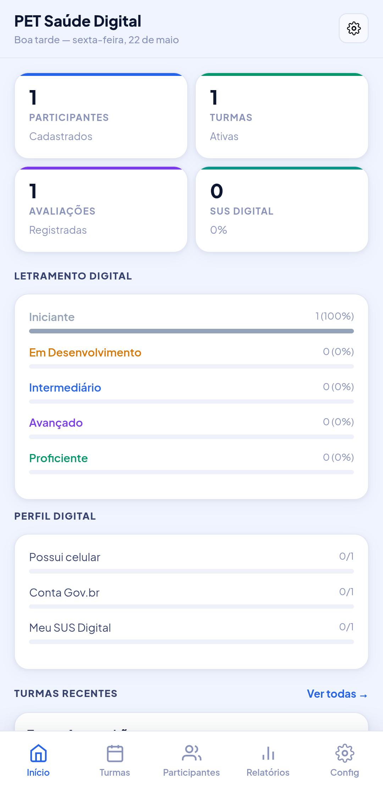
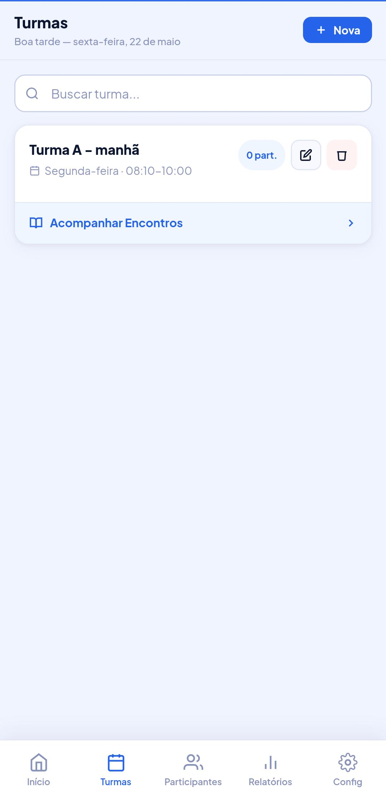
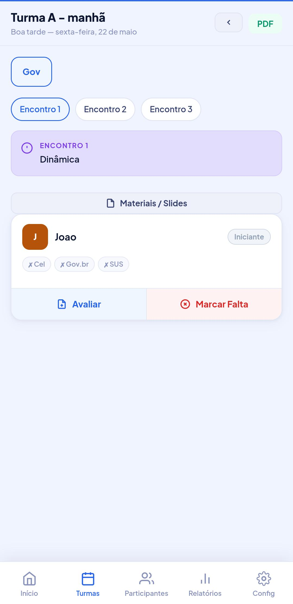
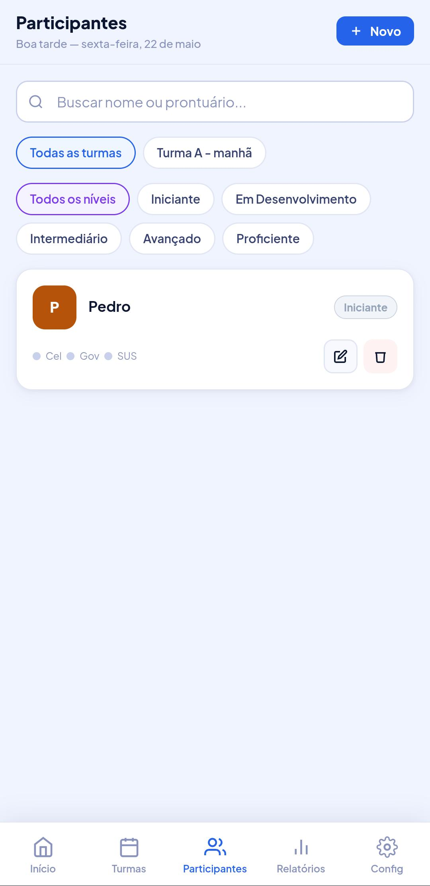
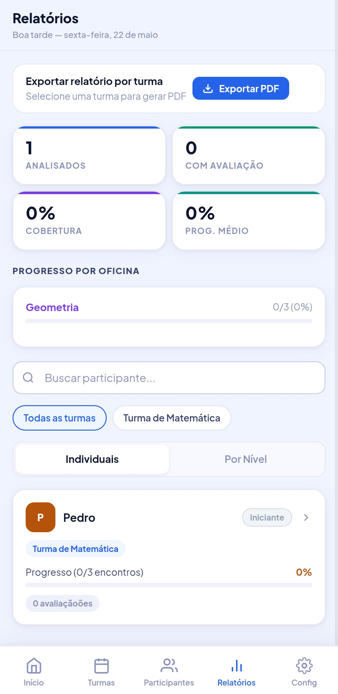
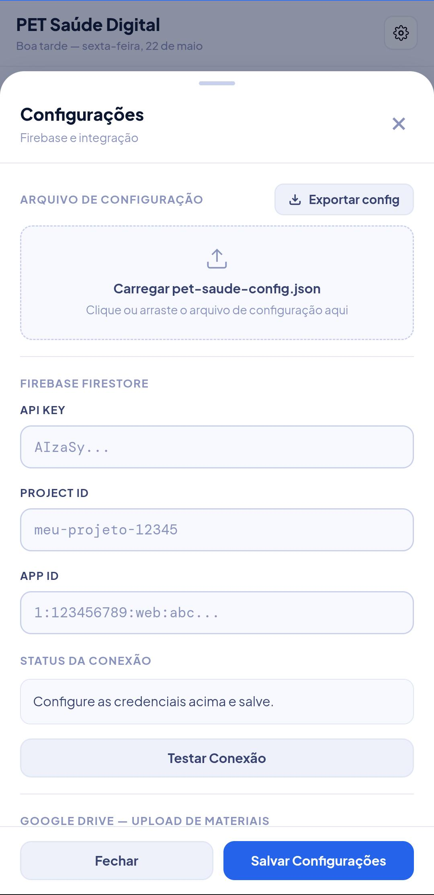
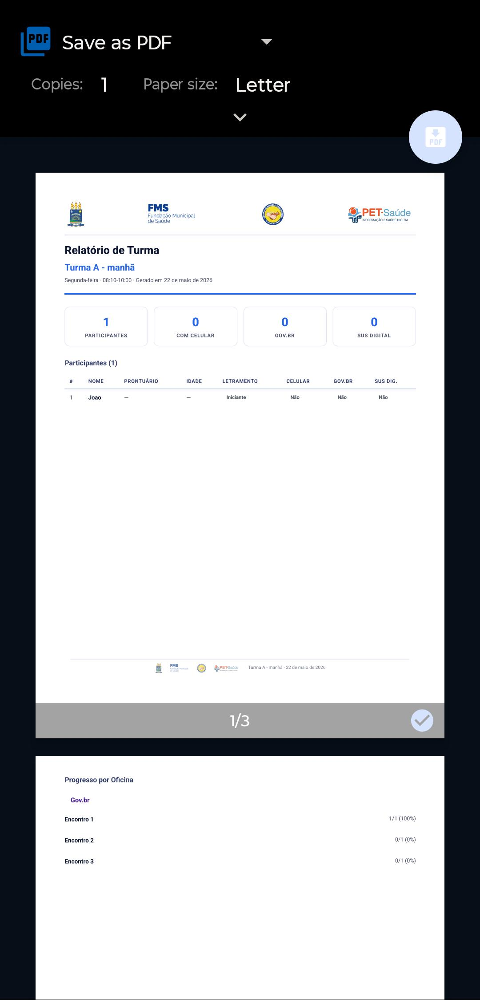

<div align="center">


# PET Saúde Digital

### Sistema de Gestão de Participantes

Aplicação web progressiva (PWA) para acompanhamento de participantes do programa PET Saúde Digital.
Desenvolvida com HTML, CSS e JavaScript puro — sem frameworks, sem servidor, sem build tools.
Roda direto no navegador com sincronização em tempo real via Firebase Firestore e integração ao Google Drive.

</div>

---

## Índice

- [Visão Geral](#visão-geral)
- [Funcionalidades](#funcionalidades)
- [Tecnologias e APIs](#tecnologias-e-apis)
- [Pré-requisitos](#pré-requisitos)
- [Configuração — Firebase Firestore](#configuração--firebase-firestore)
- [Configuração — Google Drive OAuth](#configuração--google-drive-oauth)
- [Como Hospedar o App](#como-hospedar-o-app)
- [Primeiros Passos no App](#primeiros-passos-no-app)
- [Estrutura dos Arquivos](#estrutura-dos-arquivos)
- [Funcionamento Offline PWA](#funcionamento-offline-pwa)
- [Backup e Importação de Dados](#backup-e-importação-de-dados)
- [Telas da Aplicação](#telas-da-aplicação)
- [Privacidade e Segurança](#privacidade-e-segurança)
- [Autor](#autor)

---

## Visão Geral

O **PET Saúde Digital** é um sistema de gestão pensado para equipes do programa PET Saúde que precisam acompanhar participantes em turmas, registrar avaliações por oficina, monitorar indicadores de letramento digital (Gov.br, SUS Digital, posse de celular) e gerar relatórios em PDF.

Toda a lógica roda no navegador do usuário. Os dados são armazenados localmente via `localStorage` e, opcionalmente, sincronizados em tempo real na nuvem via **Firebase Firestore** — sem nenhum servidor ou backend próprio necessário.

---

## Funcionalidades

| Módulo            | Descrição                                                                                     |
| ----------------- | --------------------------------------------------------------------------------------------- |
| **Dashboard**     | Visão geral com totais de participantes, turmas, avaliações e indicadores de inclusão digital |
| **Turmas**        | Criação e gestão de turmas com dia da semana, horário, local e participantes vinculados       |
| **Encontros**     | Acompanhamento encontro a encontro por oficina: presença, avaliações por nível e observações  |
| **Participantes** | Cadastro completo com prontuário, letramento digital, Gov.br, SUS Digital e posse de celular  |
| **Relatórios**    | Visão consolidada por turma com filtros e exportação de PDF detalhado                         |
| **Oficinas**      | Criação personalizada de workshops com encontros, tópicos e cores identificadoras             |
| **Materiais**     | Links para arquivos no Google Drive organizados por turma e encontro                          |
| **Sincronização** | Múltiplos dispositivos atualizados simultaneamente via Firebase Firestore em tempo real       |
| **PWA**           | Instalável como app no celular e computador, com suporte offline                              |
| **Backup JSON**   | Exportação e importação completa dos dados a qualquer momento                                 |

---

## Tecnologias e APIs

### Firebase Firestore

O Firestore é o banco de dados em nuvem da Google (parte do Firebase). Neste projeto ele é responsável pela **sincronização dos dados em tempo real** entre todos os dispositivos que usam o app.

**Como é utilizado:**

- Armazena todos os dados (turmas, participantes, avaliações, oficinas, materiais) em um único documento Firestore: coleção `pet_saude`, documento `dados`.
- Usa o listener `onSnapshot` para receber atualizações instantâneas quando outro dispositivo salva algo.
- Salva com debounce de 800ms a cada alteração local para evitar escritas excessivas.
- O indicador de status no rodapé da sidebar mostra se a conexão está ativa, carregando ou com erro.

**Plano necessário:** O plano **Spark (gratuito)** do Firebase é suficiente para uso normal do programa.

**SDK utilizado:** Firebase JavaScript SDK v10 carregado via CDN — sem instalação de pacotes, sem build tool:

```html
<script type="module">
  import { initializeApp } from "https://www.gstatic.com/firebasejs/10.12.0/firebase-app.js";
  import {
    getFirestore,
    doc,
    setDoc,
    onSnapshot,
    getDoc,
  } from "https://www.gstatic.com/firebasejs/10.12.0/firebase-firestore.js";
</script>
```

---

### Google Drive API (OAuth 2.0)

A integração com o Google Drive permite **vincular links de materiais** (documentos, apresentações, vídeos) a cada encontro de cada turma, sem fazer upload pelo app — os arquivos ficam no Drive do usuário.

**Como é utilizado:**

- Autentica o usuário com OAuth 2.0 via `accounts.google.com`.
- Abre o Google Picker para o usuário selecionar arquivos do próprio Drive.
- Salva apenas o nome e o link do arquivo — o conteúdo permanece no Drive.

**Escopos OAuth utilizados:**

```
https://www.googleapis.com/auth/drive.readonly
https://www.googleapis.com/auth/drive.file
```

**APIs necessárias no Google Cloud Console:** Google Drive API + Google Picker API.

---

### Service Worker (PWA)

O arquivo `sw.js` implementa um Service Worker que:

- Faz cache dos arquivos principais (`index.html`, `manifest.json`, ícones) na instalação.
- Usa estratégia **Cache First, Network Fallback** para assets locais.
- Nunca intercepta requisições do Firebase, Google Fonts ou Google OAuth (sempre vão à rede).
- Permite que o app funcione offline para consulta de dados já carregados.

---

### localStorage

Todos os dados são persistidos localmente no navegador via `localStorage` sob a chave `pet_saude_db`. O Firebase é uma camada adicional de sincronização — o app funciona completamente sem ele, apenas ficando restrito a um único dispositivo/navegador.

---

## Pré-requisitos

- Conta Google (para Firebase e Google Drive)
- Navegador moderno: Chrome, Edge, Safari ou Firefox
- Hospedagem com HTTPS — necessário para PWA e OAuth (GitHub Pages, Netlify, Vercel ou qualquer servidor com HTTPS funcionam)

---

## Configuração — Firebase Firestore

### Passo 1: Criar o projeto Firebase

1. Acesse [console.firebase.google.com](https://console.firebase.google.com)
2. Clique em **"Adicionar projeto"**
3. Dê um nome (ex: `pet-saude-digital`) e conclua o assistente
4. Na tela inicial do projeto, clique em **"Web"** (`</>`) para registrar o app
5. Dê um apelido ao app e clique em **"Registrar app"**
6. Anote as credenciais exibidas — você vai precisar de:
   - `apiKey`
   - `projectId`
   - `appId`

### Passo 2: Criar o banco Firestore

1. No menu lateral, vá em **Firestore Database**
2. Clique em **"Criar banco de dados"**
3. Escolha o modo **Produção** (as regras serão configuradas a seguir)
4. Selecione a região mais próxima — ex: `southamerica-east1` para o Brasil

### Passo 3: Configurar as Regras de Segurança

No Firestore, vá em **Regras** e substitua pelo seguinte:

```js
rules_version = '2';
service cloud.firestore {
  match /databases/{database}/documents {
    match /pet_saude/dados {
      allow read, write: if true;
    }
  }
}
```

> **Atenção:** A regra `if true` permite acesso a qualquer pessoa que tiver suas credenciais Firebase. Para uso interno de uma equipe pequena isso é aceitável. Para maior segurança, adicione autenticação Firebase e restrinja por `request.auth != null`.

### Passo 4: Inserir as credenciais no App

Abra o app → ícone de engrenagem (Configurações) no Dashboard → aba Firebase:

| Campo      | Onde encontrar                                          |
| ---------- | ------------------------------------------------------- |
| API Key    | Firebase Console → Configurações do projeto → Geral     |
| Project ID | Firebase Console → Configurações do projeto → Geral     |
| App ID     | Firebase Console → Configurações do projeto → Seus apps |

Clique em **"Testar conexão"** para validar e depois em **"Salvar Configurações"**.

---

## Configuração — Google Drive OAuth

### Passo 1: Criar credenciais no Google Cloud Console

1. Acesse [console.cloud.google.com](https://console.cloud.google.com)
2. Selecione o mesmo projeto vinculado ao Firebase (ou crie um novo)
3. No menu lateral, vá em **APIs e Serviços → Biblioteca**
4. Ative as seguintes APIs:
   - **Google Drive API**
   - **Google Picker API**

### Passo 2: Criar o Client ID OAuth

1. Vá em **APIs e Serviços → Credenciais**
2. Clique em **"Criar Credenciais" → "ID do cliente OAuth"**
3. Tipo de aplicativo: **Aplicativo da Web**
4. Em **Origens JavaScript autorizadas**, adicione a URL do seu app — ex: `https://seu-usuario.github.io`
5. Clique em **Criar** e anote o **Client ID**

### Passo 3: Configurar a Tela de Consentimento

1. Vá em **APIs e Serviços → Tela de permissão OAuth**
2. Escolha **Externo** e preencha o nome do app e o e-mail de suporte
3. Em **Escopos**, adicione:
   - `.../auth/drive.readonly`
   - `.../auth/drive.file`
4. Adicione os e-mails dos usuários autorizados (enquanto o app estiver em modo de teste)

### Passo 4: Inserir o Client ID no App

Configurações → campo **Google Client ID** → cole o Client ID → **Salvar**.

---

## Como Hospedar o App

O app é composto por apenas três arquivos: `index.html`, `manifest.json` e `sw.js`. Qualquer hospedagem HTTPS funciona.

### Opção A — GitHub Pages (gratuito, recomendado)

1. Crie um repositório no GitHub (ex: `pet-saude-acompanhamento-usuarios`)
2. Envie os arquivos: `index.html`, `manifest.json`, `sw.js`, `icon-192.png`, `icon-512.png`
3. Vá em **Settings → Pages → Source → Deploy from branch → main**
4. Seu app estará disponível em: `https://seu-usuario.github.io/pet-saude-acompanhamento-usuarios/`

> O `start_url` e `scope` no `manifest.json` já estão configurados para este padrão de URL do GitHub Pages.

### Opção B — Netlify (arrastar e soltar)

1. Acesse [netlify.com](https://netlify.com) e faça login
2. Arraste a pasta com os arquivos para a área de deploy
3. Você receberá uma URL HTTPS automaticamente

### Opção C — Qualquer servidor com HTTPS

Copie os arquivos para a raiz ou subpasta do servidor. Certifique-se de que o servidor serve `index.html` por padrão.

---

## Primeiros Passos no App

Após abrir o app pela primeira vez, siga esta ordem:

1. **Configure o Firebase** — Configurações → Firebase → insira as credenciais e salve. Necessário para sincronização entre dispositivos.
2. **Configure o Google Drive** — Configurações → Google Client ID → insira e salve. Necessário para anexar materiais.
3. **Crie as Oficinas** — Configurações → Oficinas → Nova Oficina → defina nome, nome curto, cor e os encontros.
4. **Crie uma Turma** — Turmas → Nova Turma → informe nome, dia, horário e local.
5. **Cadastre os Participantes** — Participantes → Novo Participante → preencha os dados de cada pessoa.
6. **Vincule participantes à turma** — abra a turma e use o botão para adicionar participantes.
7. **Registre avaliações** — no detalhe da turma, selecione uma oficina e encontro, clique em um participante e adicione a avaliação.

### Arquivo de configuração rápida

Para replicar as configurações em outros dispositivos sem repetir o processo:

1. Configure um dispositivo normalmente
2. Configurações → **"Exportar arquivo de configuração"** — baixa um `pet-saude-config.json`
3. Em outro dispositivo, Configurações → **"Importar configuração"** — arraste ou selecione o arquivo

---

## Estrutura dos Arquivos

```
pet-saude-acompanhamento-usuarios/
├── index.html        # App completo (HTML + CSS + JS em um único arquivo)
├── manifest.json     # Manifesto PWA (nome, ícones, cores, escopo)
├── sw.js             # Service Worker (estratégia de cache offline)
├── icon-192.png      # Ícone para instalação (192x192)
└── icon-512.png      # Ícone para instalação (512x512)
```

### Estrutura dos dados (localStorage / Firestore)

```json
{
  "classes": [
    {
      "id": "abc123",
      "name": "Turma A",
      "day": "Segunda-feira",
      "schedule": "14h–16h",
      "location": "UBS Centro",
      "userIds": ["uid1", "uid2"]
    }
  ],
  "users": [
    {
      "id": "uid1",
      "name": "Maria Silva",
      "prontuario": "12345",
      "email": "maria@email.com",
      "birthYear": "1975",
      "literacyLevel": "Básico",
      "hasCellphone": true,
      "hasGovBr": false,
      "hasSusDigital": false
    }
  ],
  "comments": {
    "classId__workshopId__Encontro 1": {
      "uid1": [
        {
          "text": "Participou ativamente...",
          "level": "Básico",
          "createdAt": "2025-05-10T14:30:00.000Z"
        }
      ]
    }
  },
  "workshops": [
    {
      "id": "ws1",
      "label": "Letramento Digital",
      "shortLabel": "Let.Digital",
      "color": "#7C3AED",
      "sessions": ["Encontro 1", "Encontro 2"],
      "topics": ["Introdução ao celular", "Internet básica"]
    }
  ],
  "materials": {
    "classId__workshopId__Encontro 1": [
      { "name": "Slides Aula 1", "url": "https://drive.google.com/..." }
    ]
  }
}
```

---

## Funcionamento Offline PWA

O app pode ser instalado como aplicativo no celular e no computador:

- **Android (Chrome):** menu do navegador → "Adicionar à tela inicial" (ou aguarde o banner automático)
- **iPhone (Safari):** botão Compartilhar → "Adicionar à Tela de Início"
- **Desktop (Chrome/Edge):** ícone de instalação na barra de endereço

Após instalado, o app abre sem barra de endereço (experiência de app nativo), carrega instantaneamente mesmo sem internet (dados em cache) e sincroniza automaticamente quando a conexão retornar.

---

## Backup e Importação de Dados

**Exportar backup:** Configurações → "Exportar JSON" — baixa um arquivo `pet-saude-backup-YYYY-MM-DD.json` com todos os dados.

**Importar backup:** Configurações → "Importar JSON" → selecione o arquivo de backup.

> **Atenção:** A importação substitui todos os dados locais. Se o Firebase estiver configurado, os dados importados serão sincronizados para a nuvem automaticamente.

---

## Telas da Aplicação

### Dashboard

<div align="center">

</div>

---

### Turmas

<div align="center">

</div>

---

### Detalhe da Turma / Encontros

<div align="center">

</div>

---

### Participantes

<div align="center">

</div>

---

### Relatórios

<div align="center">

</div>

---

### Configurações

<div align="center">

</div>

---

### PDF Exportado

<div align="center">

</div>

---

## Privacidade e Segurança

Os dados dos participantes ficam armazenados no `localStorage` do navegador e, se configurado, no Firestore do projeto Firebase da sua equipe — nenhum dado é enviado a servidores externos além do Firebase. O Google Drive é acessado apenas para que o usuário selecione arquivos; o app não lê nem modifica o conteúdo dos arquivos. Para ambientes com dados sensíveis, recomenda-se restringir o acesso ao Firestore com autenticação Firebase.

---

## Autor

<div align="center">

<br>


<br><br>

**Victor Miranda**
Desenvolvedor Fullstack

<br>

[](https://github.com/victor-kauan-coder)
&nbsp;
[](https://www.linkedin.com/in/victor-miranda-5342a6337)

<br>

> _"Desenvolvido para apoiar equipes de saúde na gestão e acompanhamento de participantes do PET Saúde Digital — UFPI / FMS / CAPS."_

<br>

</div>
